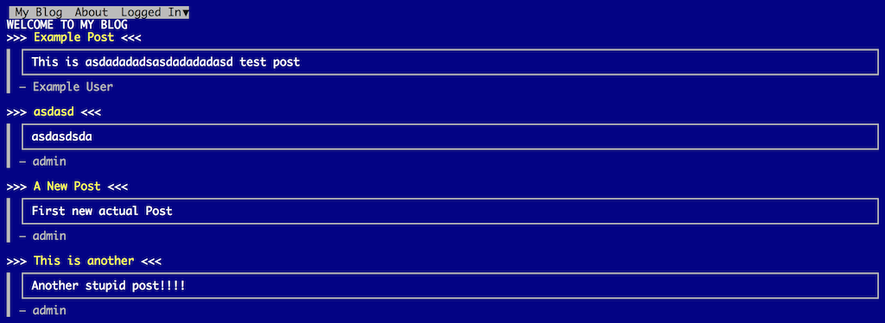
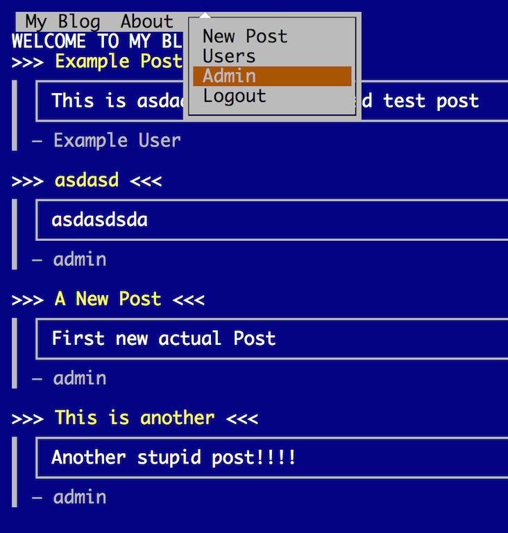
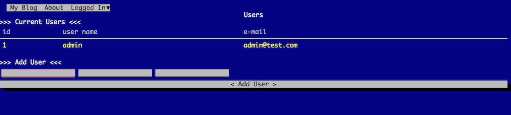

blog386
=======

A Node.js Blogging Platform, using the 386-Bootstrap theme.

This platform will let you make your presence known painfully on the web
by reducing the server to the speed of a late 80's 32-bit CPU

Painfully bring your clients to their knees with this awesome
recreation of old DOS software in EGA mode

Installation
============

Like all good DOS Software this is a pain to install,
setup your postgres db - create a database, and run the
schema.sql script - once that is done be sure to load the data
in blog_data.sql. Otherwise the program will just crash and burn.

Once that is done the login is admin with the password test,
you might want to change it quickly, before you are exploited on the internet

Shout outs!
===========

Old retro shout out to the people involved in BOOTSTRA.386
because with out you this would not be possible!
And Geo for Boostrap.

All the guys at Twitter!
The fine developers of PostgreSQL
The awesome dudes at Node.js!

Live Version
============
See it at http://blog386.herokuapp.com/

Main Page
==========

Menus
==========

Admin
=======

